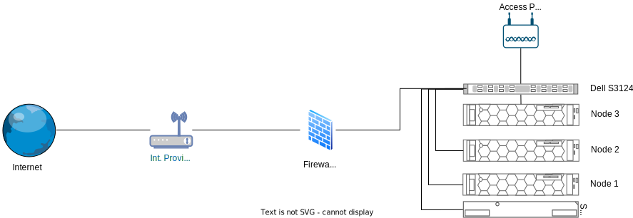

+++
title = 'Building My Homelab: Hardware, Setup, and Future Plans'
date = 2024-09-06T15:43:41-05:00
tags = ['homelab', 'Proxmox', 'networking', 'virtualization', 'IaC']
#categories = ['Homelab']
+++

Embarking on my journey into web security and networking, I've taken a significant step by acquiring three Dell PowerEdge R740xd servers and other hardware on an auction. Now, this hardware forms the backbone of my new homelab, where I plan to explore, experiment, and document my experiences. In this post, I'll walk you through the specs of my setup, the roles I've assigned to each server, and some ideas I have for future projects.

## Hardware Overview

### Servers: Dell PowerEdge R740xd

The cornerstone of my homelab is the trio of Dell PowerEdge R740xd servers. These robust machines offer impressive performance and scalability, making them ideal for a variety of tasks within my setup.

#### Node breakdown

#### Node 1 & 2 - Key Specifications:

* Processor: Dual Intel(R) Xeon(R) Gold 6152 (22 cores each)
* Memory: 256GB DDR4 RAM
* Storage:
    - 2.5” bays
* Networking: 
    - DELL BroadCom 5720-t rNDC 4-Port Gigabit
    - BroadCom GbE 2-Port 5720-t Adapter

#### Node 3 - Key Specifications:

* Processor: Dual Intel(R) Xeon(R) Silver 4215 (8 cores each)
* Memory: 128GB DDR4 RAM
* Storage:
    - 3.5” bays
    - Two 4Tb disk
    - Four 2Tb disk
* Networking: 
    - DELL BroadCom 5720-t rNDC 4-Port Gigabit
    - BroadCom GbE 2-Port 5720-t Adapter

#### The Hypervisor: Proxmox

Initially, I considered VMWare ESXi, but due to licensing changes earlier this year, I opted for Proxmox as my hypervisor.
Installing Proxmox on the Dell servers was straightforward, and it offers a user-friendly interface to manage virtual machines (VMs) and containers efficiently.

I choose Promox because it offers:

- Flexibility: Supports both KVM for full virtualization and LXC for lightweight containers.
- Clustering: Easily manage multiple servers as a single cluster.
- Community Support: Extensive documentation and a supportive community make troubleshooting and expanding my setup easier.
- Web-based interface: I can do all management tasks with the integrated graphical user interface (GUI)
- Based on Debian GNU/Linux

### Networking

To facilitate communication between the servers and other devices in the network, I’ve integrated a 24-port Gigabit switch DELL S3124.

With multiple 6 Ethernet ports per server, I plan to set up a LAG interface, I've connected them using 3 ports to the switch. By aggregating these connections, I aim to:

- Increase Bandwidth: Combine the throughput of multiple ports to handle higher data loads.
- Enhance Redundancy: Ensure network availability even if one or more links fail.

I’ve set up multiple VLANs to segregate and manage network traffic more effectively:

- LAN (Trusted Devices VLAN): This is the default network for all trusted devices, ensuring secure communication between internal systems.
- Management VLAN: Dedicated to administrative tasks, this VLAN connects critical management interfaces like the Integrated Dell Remote Access Controller (iDRAC) for servers, Proxmox UI, firewall, switches, and access points. It isolates management traffic from other network activities to enhance security.
- IoT VLAN: Designed for untrusted devices such as IoT gadgets. By isolating them, we minimize the risk of potential threats impacting other parts of the network.
- Guest VLAN: This VLAN is for guest devices, ensuring they remain isolated from critical systems and sensitive data while providing internet access.

## Future Plans

As I continue to build and expand my homelab, I’m excited to explore the following:

- Infrastructure as Code (IaC): Automating the creation and configuration of virtual machines, containers, and entire environments within my homelab. This will streamline my processes and enable me to experiment with complex setups effortlessly.

- Network Simulation: Using GNS3, I aim to simulate various network configurations, study new algorithms, and prepare for certifications like the CCNA.

- Expanding NAS Capabilities: Beyond file storage, I’m considering how Node 3 can serve other roles, such as media storage, backups, or even a private cloud solution.

- Running penetration testing labs or simulating attack/defense scenarios.

### Exploring Infrastructure as Code (IaC)

One of my key goals is to implement Infrastructure as Code (IaC) to automate the creation and management of my labs. By using tools like Terraform or Ansible, I plan to:

- Automate VM and Container Deployment: Quickly spin up environments tailored to specific projects or experiments.
- Ensure Consistency: Maintain uniform configurations across different setups, reducing the potential for errors.
- Streamline Management: Simplify updates and changes, making my homelab more efficient and scalable.

### Network Simulation with GNS3

Networking is a critical component of my transition into web security, and I’m eager to explore network simulation tools like GNS3. Here’s how I plan to utilize Node 1:

- Network Design and Testing: Simulate complex network topologies to test configurations and troubleshoot issues before deploying them in a live environment.
- Studying Network Algorithms: Dive deep into how different protocols and algorithms function, enhancing my understanding for future certifications.
- CCNA Preparation: Use simulated environments to practice and prepare for the Cisco Certified Network Associate (CCNA) exam.